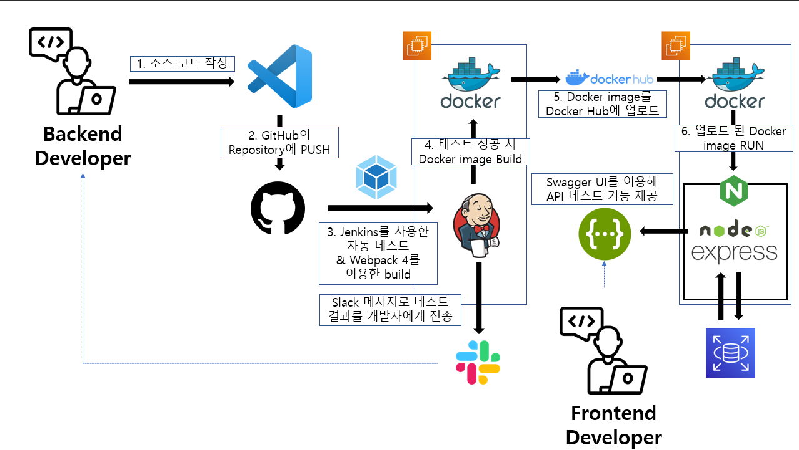

# whateattoday

> Community service that shares restaurants, "오늘 뭐 먹지? / Whateattoday"

## Description

> Backend server with Node.js and express and CI/CD pipeline with Docker and Jenkins

## Architecture

## Features

- CI/CD with Docker and Jenkins
- Specification of REST API using Swagger
- REST API Test Using Swagger
- WAS on the restaurant sharing community site using Node.js and Express

## Installation

### User Guide
- [ User Guide ](docs\user_guide.md)

### Developer Guide
- [ Developer Guide ](docs\developer_guide.md)

## Technologies & Libraries Used

## Contributors

- [ Geunwoo Noh / Apdul ](https://github.com/Apdul0329)

## License

[MIT License](https://github.com/royroyee/kubem/blob/main/LICENSE)