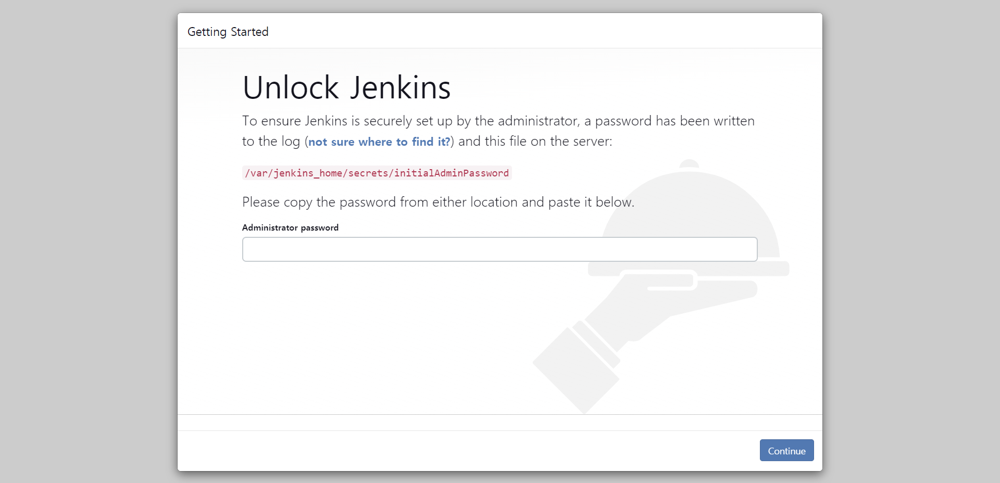
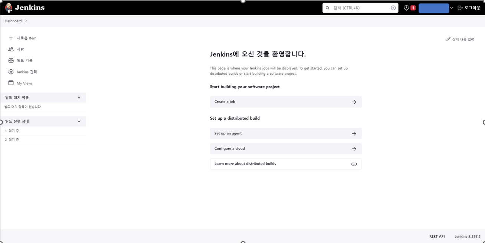
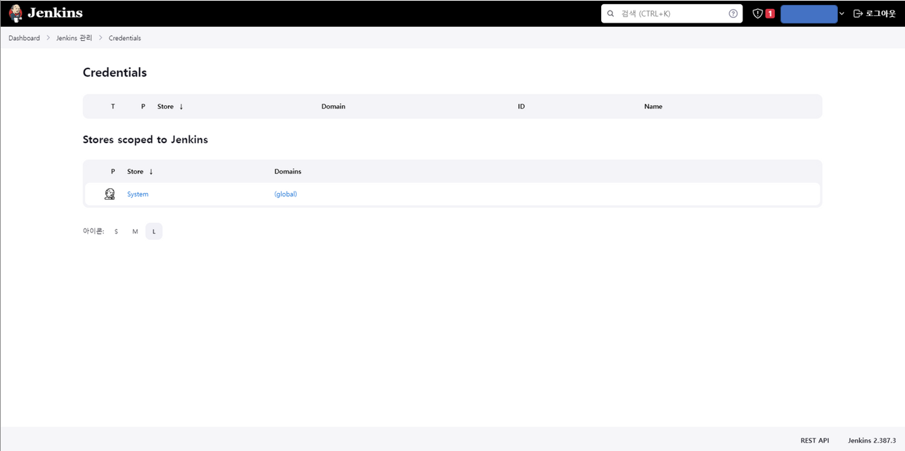
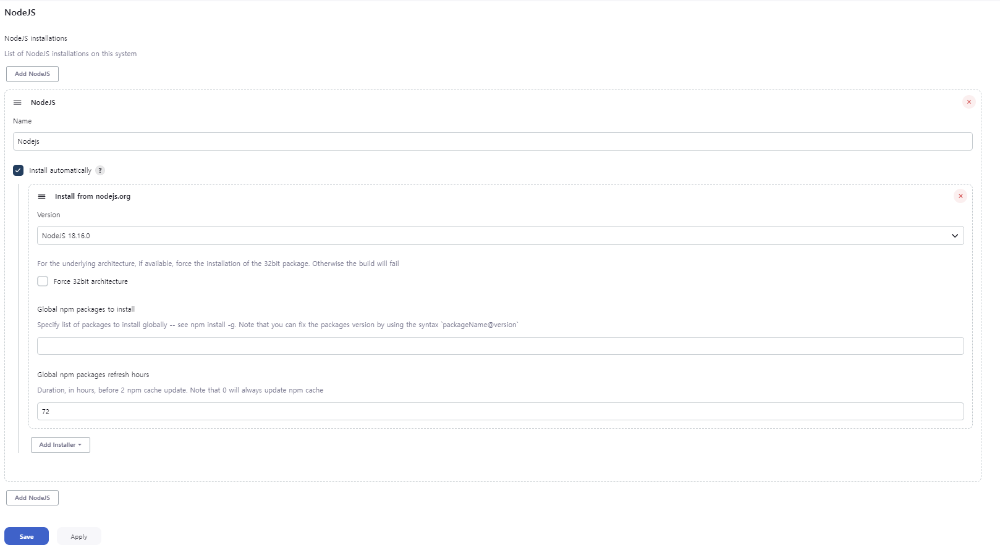
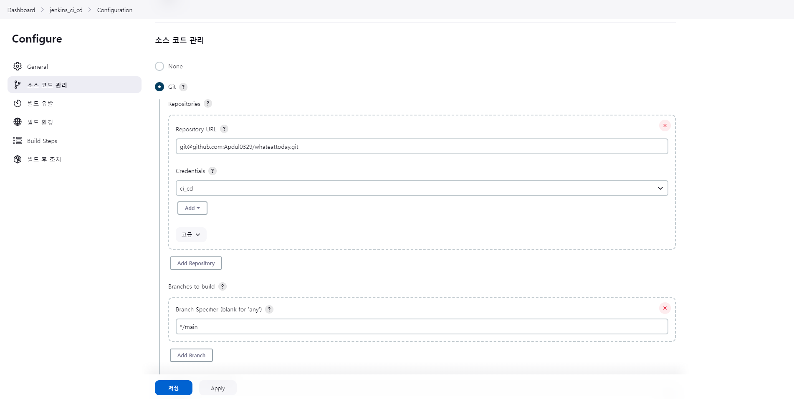
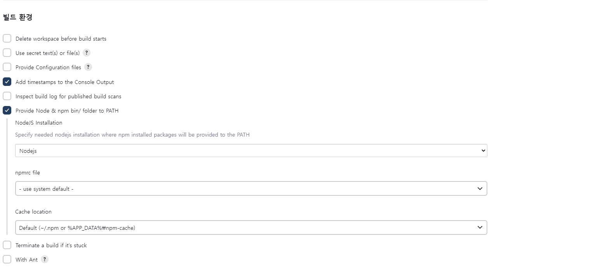
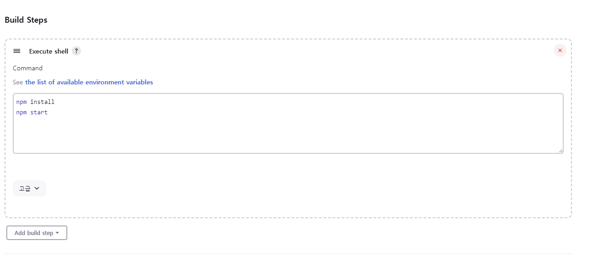
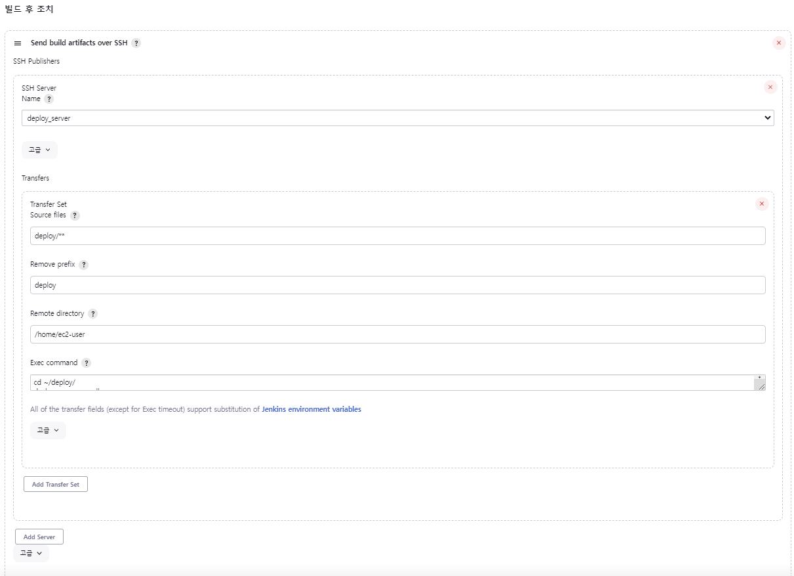
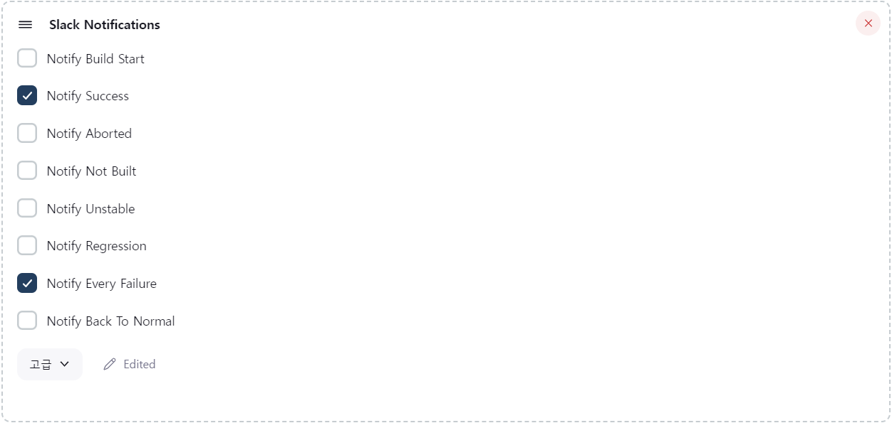

# Developer Guide

Quick install for developer

## Step 1 - Environmental Preparation

- Linux
- 2 Servers
    - Need to open port for Jenkins and WAS
- Docker
    - Docker compose
    - Docker Hub
        - Create Docker Hub repository for use in this project
- Jenkins
    - Only installed on the server for CI/CD

## Step 2 - Clone repository on server for CI/CD
```
git clone https://github.com/Apdul0329/whateattoday.git
```

### Personalization
```
git clone https://github.com/your ID/whateattoday.git
```


## Step 3 - Run Jenkins container with Docker Compose
```
docker-compose -f ./whateattoday/jenkins/docker-compose.yml up -d
```

## Step 4 - Jenkins setting before use
> These are the setup and plug-in installation steps before using Jenkins.

1. Access ```http://your_server_ip:8080/``` to enter Jenkins
    - If the following screen appears, it's a success
    
2. Follow the instructions on the screen to install plug-in and input login information
    - If this procedure is successful, the following screen appears
    

## Step 5 - Create SSH key for GitHub webhook
``` Bash
docker exec -it jenkins_cicd /bin/bash

# .ssh 위치에 키 저장
mkdir /var/jenkins_home/.ssh
cd /var/jenkins_home/.ssh

# ssh 키 생성
ssh-keygen -t rsa -f /var/jenkins_home/.ssh/jenkins_ci

# ssh 개인 키 복사
cat jenkins_ci
```

### Step 5.1 - Register SSH private key on Jenkins
- After executing the above commands, enter ```Jenkins 관리 > Credentials``` in Jenkins and register the ssh private key

    - If you go into the path, you can see screen as above
    - Click ```global > Add credentials``` and enter SSH private key on the page entered


### Step 5.2 - Register SSH public key on GitHub
``` Bash
cat jenkins_ci.pub
```

- After executing the above command, register SSH public key on GitHub


### Step 5.3 - Setting GitHub Webhook
- Click ```Setting > Webhook > Add webhook``` and enter ```http://your_server_ip:8080/github-webhook``` in ```Payload URL```


## Step 6 - Install Node.js plug-in

1. Click ```Jenkins 관리 > 플러그인 관리``` and install ```NodeJS Plugin```
2. After installation, click ```Jenkins 관리 > Global Tool Configuration``` and set Node.js version as below


## Step 7 - Create & Set up job

### Step 7.1 - Create job
- Click ```새로운 item``` & enter an item name with ```Freestyle project```

### Step 7.2 - Set up Source Code Management
- Click ```소스 코드 관리``` and enter GitHub SSH URL as below


### Step 7.3 - Set up Build Trigger
- Go to ```소스 코드 관리 > 빌드 유발``` and select ```GitHub hook trigger for GITScm polling```

### Step 7.4 - Set up Build Environment
- Go to ```소스 코드 관리 > 빌드 환경``` and set up like below


### Step 7.5 - Set up Build Steps
1. Add ```Execute shell``` for building ```node_modules``` using ```Webpack4```


2. Add ```Execute shell``` for setting up ```.env```
```Bash
cat << EOF > .env
COOKIE_SECRET = INPUT_YOUR_COOKIE_SECRET
PORT=8000                                   # This port is using for dev
HOST= INPUT_YOUR_DB_HOST
USER= INPUT_YOUR_DB_USER
DB_PASSWORD= INPUT_YOUR_DB_PASSWORD
DB_PORT= INPUT_YOUR_DB_PORT
DATABASE= INPUT_YOUR_DB_NAME
SERVER_IP= INPUT_YOUR_SERVER_IP_FOR_DEPLOY
SERVER_PORT= INPUT_YOUR_PORT_FOR_DEPLOY
EOF
```
- Make a copy of the above code to suit your project

3. Add ```Execute shell``` for executing script to CD
``` Bash
bash /var/jenkins_home/workspace/YOUR_JOB_NAME/docker_cd.sh "YOUR_DOCKER_HUB_REPOSITORY" "DOCKER_HUB_ID" "DOCKER_HUB_PW"
```
- Make a copy of the above code to suit your project

### Step 7.6 - Set up Post Build Task
1. Click ```빌드 후 조치``` and add ```Send build artifacts over SSH```
2. Set up like below
      

## Step 8 - Install Slack plug-in & Connect Jenkins to Slack

### Step 8.1 - Set up Slack
1. Create WorkSpace for Jenkins
2. Install Jenkins app in Slack
3. Record the information at the end when you follow the installation procedure, which will be used in ```Step 8.3```

### Step 8.2 - Install Slack plug-in
- Click ```Jenkins 관리 > 플러그인 관리``` and install ```Slack Notification```

### Step 8.3 - Manage Credentials for Slack
1. Click ```Jenkins 관리 > Credentials > System global > Add credentials```
2. Select ```secret text``` in ```Kind```
3. Enter information recorded in ```Step 8.1```

### Step 8.4 - Set up Post Build Task for Slack
1. Click ```빌드 후 조치``` and add ```Slack Notifications```
2. Set up like below
    
    - Set ```advanced settings``` to suit your own slack workspace