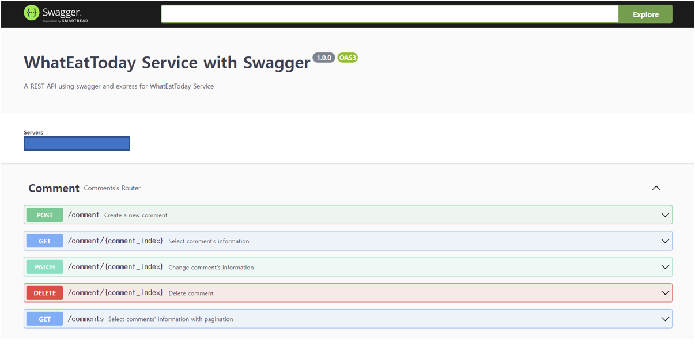

# User Guide

## Swagger UI


- Access to Swagger API documents at ```http://YOUR_SERVER_IP/api-docs/```
    - You can check the REST API specification on this page
    - You can test the REST API on this page
- ```Servers``` must be selected as ```http://YOUR_SERVER_IP:80```
    - Origins starting with http://localhost are for development purposes
- 